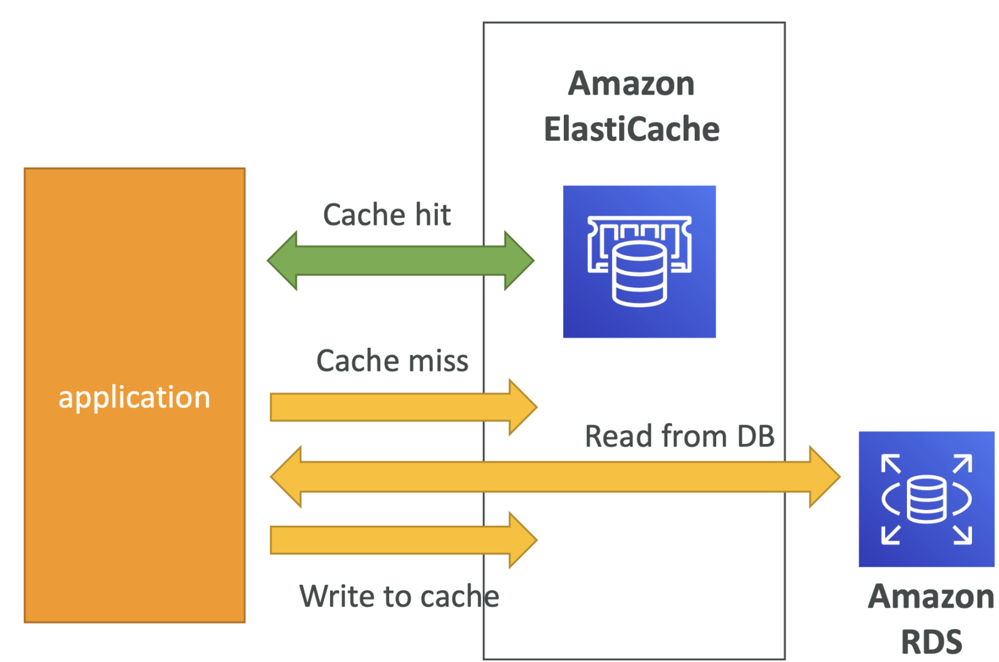
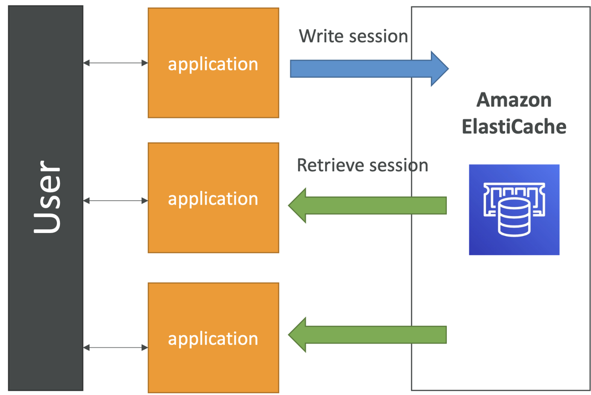
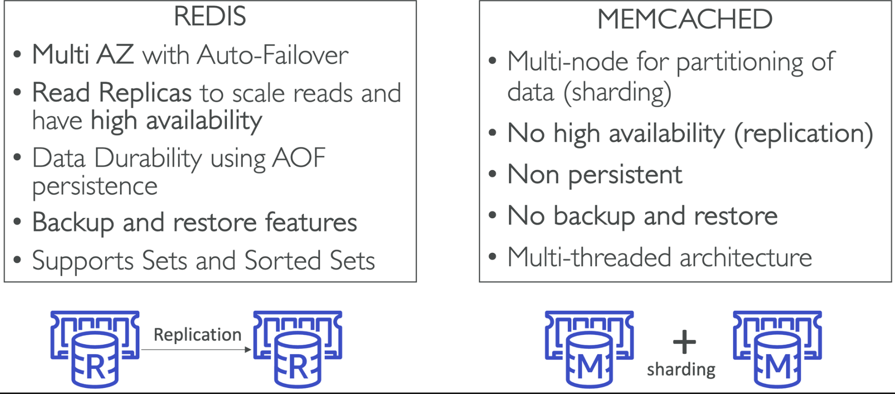

# Elastic Cache

## 특징 요약

1. 관리형 Redis 또는 Memcached: ElastiCache는 Redis와 Memcached를 모두 지원하며, 이는 자주 액세스되는 데이터를 캐싱하기 위한 인메모리 데이터베이스다.
1. 캐시(고성능을 위한 인메모리 데이터베이스): ElastiCache를 사용하면 데이터를 인메모리에 저장하여 기존의 디스크 기반 데이터베이스보다 빠른 액세스 시간과 낮은 대기 시간을 얻을 수 있다.
1. 주 데이터베이스의 부하 감소: 자주 액세스되는 데이터를 캐싱함으로써 ElastiCache는 주 데이터베이스의 읽기 중심 워크로드를 줄여 전체 시스템 성능을 향상시킬 수 있습니다.
1. 상태가 없는(stateless) 애플리케이션 설계: ElastiCache를 사용하면 애플리케이션을 상태가 없도록 설계할 수 있습니다. 상태가 없는 아키텍처에서는 각 클라이언트 요청이 해당 요청을 충족하는 데 필요한 모든 정보를 포함하므로 서버 측에 저장된 데이터에 대한 의존성이 줄어든다.
1. 상당한 애플리케이션 코드 변경이 필요함: ElastiCache를 구현하는 것은 애플리케이션 코드에 상당한 변경을 필요로 할 수 있습니다. 왜냐하면 ElastiCache에서 제공하는 캐싱 메커니즘을 효과적으로 활용하기 위해 애플리케이션 코드를 꽤나 수정해야한다.

## Elastic Cache를 활용한 아키텍처 : DB cache

1. **ElastiCache로의 쿼리 및 RDS에서의 백업:** 애플리케이션은 ElastiCache에 데이터를 조회하고, ElastiCache에서 필요한 데이터를 가져올 수 없는 경우 RDS에서 데이터를 가져와 ElastiCache에 저장한다. 이를 통해 RDS의 부하를 완화하고 더 빠른 응답 속도를 얻을 수 있다.
1. **RDS 부하 완화:** ElastiCache를 사용하여 데이터를 캐싱함으로써, 주 데이터베이스인 RDS에 대한 부하를 감소시킬 수 있다. 자주 요청되는 데이터는 ElastiCache에 저장되어 필요할 때 더 빠르게 제공될 수 있다.
1. **캐시의 무효화 전략 필요:** 캐시는 항상 최신 데이터를 유지해야 하므로, 캐시된 데이터가 무효화되는(invalidation) 전략이 필요하다. 즉 데이터가 변경될 때 캐시에서 해당 데이터를 제거하고 필요한 경우 다시 가져오는 방식이 필요하다.

## Elastic Cache를 활용한 아키텍처 : User Session Store

아래는 시간 순의 흐름이다.

1. **사용자 로그인:** 사용자가 어떤 애플리케이션에 로그인합니다. 이때 사용자에 대한 세션 정보가 생성됩니다.
1. **세션 데이터 ElastiCache에 기록:** 애플리케이션은 사용자의 세션 데이터를 ElastiCache와 같은 인메모리 데이터베이스에 기록합니다. 이는 로그인 정보, 권한, 세션 토큰 등을 포함할 수 있습니다.
1. **다른 인스턴스에서 애플리케이션 실행:** 사용자가 이미 로그인한 상태에서 다른 인스턴스 또는 다른 서버로 애플리케이션에 접속합니다.
1. **세션 데이터 검색:** 새로운 서버 인스턴스는 ElastiCache나 인메모리 데이터베이스에서 사용자의 세션 데이터를 검색합니다.
1. **사용자는 이미 로그인된 상태 검증:** 검색된 세션 데이터를 통해 사용자는 이미 로그인되어 있는 상태로 간주됩니다. 따라서 사용자는 새로운 인스턴스에서도 로그인 상태를 유지할 수 있습니다.

이를 통해 애플리케이션은 무상태성을 띈다.

## **Redis vs Memcached**

### **Redis**

1. **다중 AZ와 자동 장애 조치:** Redis는 다중 가용 영역(Multi-AZ)을 지원하며, 자동 장애 조치 기능이 있어 가용성을 높일 수 있습니다.
1. **읽기 전용 복제:** 읽기 전용 복제본을 생성하여 쓰기 작업을 분산시키고 성능을 향상시킬 수 있습니다.
1. **데이터 내구성과 AOF 지속성:** Redis는 [AOF(Append-Only File)](./sub/aof.md) 지속성을 통해 데이터 내구성을 보장하며, 데이터의 지속성을 유지합니다.
1. **백업과 복원 기능:** Redis는 데이터의 백업과 복원을 지원하여 데이터를 안전하게 관리할 수 있습니다.
1. **데이터 구조 지원:** Redis는 다양한 데이터 구조를 지원하며, 세트와 정렬 세트와 같은 고급 데이터 구조를 사용할 수 있습니다.

### **Memcached:**

1. **데이터 파티셔닝과 샤딩:** Memcached는 데이터 파티셔닝을 통해 여러 노드에 데이터를 분산시키는데, 이를 샤딩이라고 합니다.
1. **고가용성 부재:** Memcached는 고가용성을 지원하지 않고, 데이터 손실을 감수해야 합니다.
1. **복제와 백업/복원 부재:** Memcached는 데이터의 복제와 백업/복원 기능이 없어, 지속성과 안정성 측면에서 부족합니다.
1. **다중 스레드 아키텍처:** Memcached는 다중 스레드 아키텍처를 사용한다. 샤딩의 결과로 노드의 메모리에 데이터가 저장되면 멀티 스레드로 여러 요청을 동시에 처리할 수 있다.
